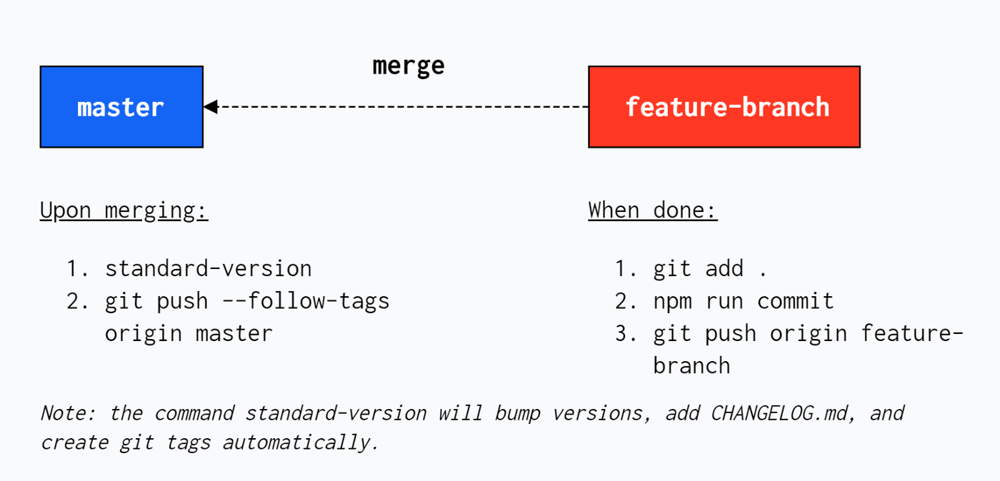

# iKhan - Personal
My personal website built using Angular to keep track of my projects and to showcase my work to the public.

<p align="center">
  
   
</p>


## Content
- [X] Pages
	- [X] Homepage
	- [X] Profile
	- [X] Projects
		- [X] Language Filters
		- [X] Projects List
		- [X] Attach Photo Gallery to all Projects
	- [X] Photography
		- [X] Image Slider
		- [X] Grid Layout for Images
		- [X] Fetch Grid Layout Images Data from Firebase Storage API
		- [X] Attach Photo Gallery to all Images
- [X] Features
	- [X] Light / Dark mode
	- [X] Increase / Decrease font-size
	- [X] Support Internationalization (i18n)
	- [X] Notifications
		- [X] Welcome Message
		- [X] Internet Connection Failure
		- [X] General Error Message
- [X] SEO
	- [X] Change HTML Tags based on language change
		- [X] Add / Update meta tags 
			- keywords
			- author
			- description
		- [X] Set lang Attribute
		- [X] Set Page Title
	- [X] Add sitemap.xml
	- [X] Add robots.txt


## Libraries and Frameworks

#### Internal
- [X] [SCSS Framework](https://github.com/imransilvake/SCSS-Framework)

#### External 
- [X] [Angular CLI](https://cli.angular.io/)
- [X] [Firebase](https://firebase.google.com/)
- [X] [i18n - NGX Translate](https://github.com/ngx-translate/core)
- [X] [RxJs](https://rxjs.dev/)
- [X] [HammerJS](https://hammerjs.github.io/)
- [X] [Moment](https://momentjs.com/)
- [X] [FontAwesome](https://fontawesome.com/)


## Environments
|Serve|Script|Description|
|---|---|---|
|Development|`yarn start`|Serve the application @ `localhost:1500`|
|Next|`yarn serve.app.next`|Serve the application @ `localhost:2000`|
|Production|`yarn serve.app.prod`|Serve the application @ `localhost:3000`|

|Build|Script|Description|
|---|---|---|
|Development|`yarn build`|Build the application to `./dist` directory|
|Next|`yarn build.app.next`|Build the application to `./dist` directory|
|Production|`yarn build.app.prod`|Build the application to `./dist` directory|


## Prettier & Linting

#### Prettier
|Script|Description|
|---|---|
|`yarn pretty:check`|Check Typescript and Json|
|`yarn pretty:apply`|Apply Typescript and Json|

#### Linting
|Script|Description|
|---|---|
|`yarn lint:es`|Lint Typescript and Json|
|`yarn lint:scss`|Lint SCSS|


## SCSS
Include the following import in each component to get access to [SCSS helpers and methods](https://github.com/imransilvake/SCSS-Framework/blob/master/documentation/guide.md).
```
@import 'scss-methods';
```


## Tools Configuration

#### Prettier & Linting
Prettier and Eslint

#### Pre-commit & Commitlint
- `pre-commit`: Husky and lint-staged
- `commit-msg`: commitlint checks if your commit messages meet the conventional commit format.

#### Automate Versioning
commitizen and standard-version

#### Continuous integration (CI) & continuous delivery (CD)
Husky and lint-staged


## Releasing
A summary of development workflow with standard-version involving multiple git branches.

<p align="center">
  
</p>

#### 1. **[feature-branch]** Stage modified files using:
```
git add .
```

#### 2. **[feature-branch]** Commit the files using git-cz package:
```
npm run commit
```

#### 3. **[feature-branch]** Now that all files have been committed, they are ready to be pushed to the remote:
```
git push origin <feature-branch>
```

#### 4. **[Bitbucket]** Create a Pull Request to master branch.
Manual from Github repository.

#### 5. **[master]** After it is merged, the following steps are done within the master branch:
Run the release command which will bump versions based on commit types, add commit descriptions to CHANGELOG.md, and create git tags according to the current version.
```
npm run release
```

Push changes and git tags to master branch using:
```
git push --follow-tags origin master
```
